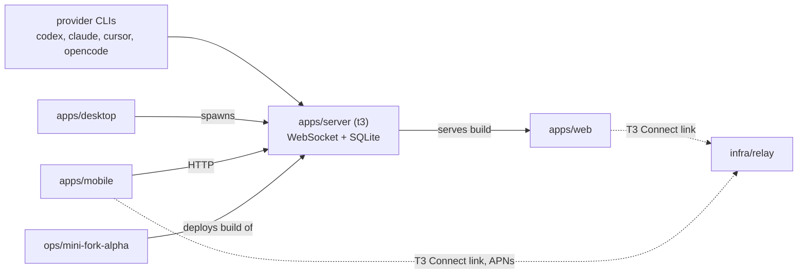

# t3code

Milad's private fork of T3 Code, a web GUI for coding agents. A Node.js WebSocket server
wraps provider CLIs (Codex app-server over JSON-RPC on stdio, plus Claude, Cursor, and
OpenCode) and serves a React app that renders sessions, threads, and diffs. Upstream ships
as an npm CLI (`t3`), an Electron desktop app, an Expo mobile app, a hosted Vercel web app,
and a Cloudflare Worker control plane. This fork adds a self-hosted alpha server on the Mac
Mini, Claude Code session import, and a gateway provider that routes every Claude and GPT
model through one instance.

## Components

Seven independently operated components, plus a non-independent shared-library and tooling
group. The prior inventory counted five, most likely the five directories under `apps/`.
That misses `infra/relay`, which has its own deploy workflow and its own database, and
`ops/mini-fork-alpha`, which is local to this fork and has no upstream counterpart.

| Component | Path | What it is |
|---|---|---|
| `apps/server` (`t3`) | `apps/server/` | Node WebSocket and HTTP server and CLI. Wraps the provider CLIs, serves the built web app, owns the event-sourced engine and its SQLite store. Published to npm as `t3`. |
| `apps/web` (`@t3tools/web`) | `apps/web/` | React and Vite browser client. Served by the local server, and deployed standalone to Vercel as the hosted app. |
| `apps/desktop` (`@t3tools/desktop`) | `apps/desktop/` | Electron shell that spawns a desktop-scoped server. Distributed as macOS DMG, Linux AppImage, and Windows NSIS with electron-updater. |
| `apps/mobile` (`@t3tools/mobile`) | `apps/mobile/` | Expo React Native app for iOS and Android. Not yet distributed. Ships via EAS preview and production. |
| `apps/marketing` (`@t3tools/marketing`) | `apps/marketing/` | Astro static product site. No in-repo deploy target found. |
| `infra/relay` (`t3code-relay`) | `infra/relay/` | The T3 Connect control plane. Cloudflare Worker deployed by Alchemy, backed by PlanetScale Postgres, links environments and registers mobile devices. |
| `ops/mini-fork-alpha` | `ops/mini-fork-alpha/` | Local only. Versioned deployment contract that runs the fork's own server build on the Mac Mini and keeps it healthy. |

`packages/*`, `oxlint-plugin-t3code`, and `scripts` are the shared-library and tooling
group, consumed by the seven above and not operated on their own. `docs/`, `.plans/`, and
the vendored `.repos/` subtrees ship no operation and are not components.

## Fork boundary

This is the load-bearing fact, because it governs who can change what. `origin` is
`mimen/t3code`, `upstream` is `pingdotgg/t3code`, and upstream does not accept
contributions. The divergence is therefore permanent, and the periodic upstream merge is
the real maintenance operation. It is currently about 1761 commits overdue against a
196-file local delta, which makes it the single largest foreseeable piece of work here.

Local to this fork:

- All of `ops/mini-fork-alpha/`.
- `.github/workflows/mini-fork-alpha-eligibility.yml`, the eligibility gate that signs and publishes the Mini's deploy-eligible ref.
- A 16-line "Fork Desktop Launch Guardrail" block at the top of `AGENTS.md`. The rest of that file is upstream.
- Feature work inside upstream components: `apps/server/src/claudeSessions/`, the `sessionImport` and `mini` CLIs, the `claudeGptProvider` and `ClaudeBinaryIntegrity` server modules, persistence migrations 034-037, and edits across `apps/web`, `apps/mobile`, `apps/desktop`, `packages/contracts`, and `packages/client-runtime`.

Everything else is upstream, including `README.md`, all of `docs/`, every workflow except
the eligibility one, and all of `infra/relay/`. A change to any of those is a change to code
the next upstream merge will overwrite.

## How they relate

The server is the hub. It wraps the provider binaries and serves the web client, the
desktop shell spawns its own copy of it, and the mobile app reaches it over HTTP. The relay
is a control plane, not a data path. It links a client to a remote environment (a running
server on a user's machine), and after the link is made traffic goes directly between the
two. `ops/mini-fork-alpha` operates the server, deploying immutable release checkouts of the
fork's build to the Mini and swapping the active one by symlink.

## What the components share

**One pnpm 11 monorepo on Node `^24.13.1`, driven by Vite+ (`vp`), not by plain pnpm or
Bun.** `vp` is a separate global binary installed by curl from `https://vite.plus`. It owns
dev, build, typecheck, lint, test, and packaging across every workspace member.

**One configuration root.** `scripts/lib/public-config.ts` reads the repository-root `.env`,
then `.env.local`, then `process.env`, and fans derived public values out to `T3CODE_*`,
`VITE_*`, and `EXPO_PUBLIC_*` aliases. Secrets stay out of the tree and inject at runtime.
The `t3.json` worktree-create hook symlinks that single root `.env` into every worktree, so
all worktrees share one mutable config file, and a relay deploy that rewrites the root
`.env` changes the relay URL for all of them at once.

**Effect 4 beta is the dominant idiom** across server, relay, contracts, and scripts, with
`packages/contracts` holding the Effect Schema contracts for the provider events and the
WebSocket protocol that the clients and server both speak.

## Repo-level gaps

**The fork inherited upstream workflows that act on the outside world.** `deploy-relay.yml`
deploys the production Cloudflare and PlanetScale stack on every push to `main`, and
`release.yml` runs a three-hourly cron that publishes the npm package `t3`. Whether either
actually runs on `mimen/t3code` depends on whether Actions is enabled and whether GitHub
treats the repo as a fork, which was not checked. Treat this as unverified. Resolve with
`gh api repos/mimen/t3code --jq '.fork'` and `gh run list -R mimen/t3code`.

**No root index of components and deployment targets.** Four good component runbooks exist
(`docs/operations/release.md`, `infra/relay/README.md`, `ops/mini-fork-alpha/README.md`,
`apps/mobile/README.md`) but three are reachable only by guessing the directory. The README
never says this is a fork, and `docs/getting-started/quick-start.md` still tells a new
developer to run `bun run dev`, which the Vite+ toolchain no longer supports.

**No ADRs and no process identity.** Decisions like the event-sourced model and Vite+ over
pnpm have no recorded rationale outside `.plans/`. No resident process sets an `<app>:<role>`
argv name, so the Mini server, four worktree servers, and a desktop-spawned backend all
appear as anonymous `node` in `ps`.
