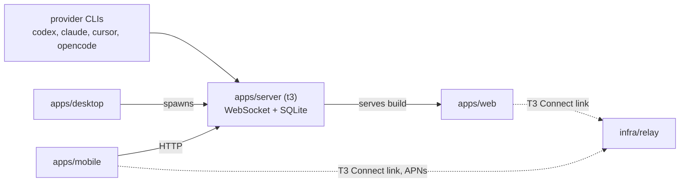

# t3code

Milad's private fork of T3 Code, a web GUI for coding agents. A Node.js WebSocket server
wraps provider CLIs (Codex app-server over JSON-RPC on stdio, plus Claude, Cursor, and
OpenCode) and serves a React app that renders sessions, threads, and diffs. Upstream ships
as an npm CLI (`t3`), an Electron desktop app, an Expo mobile app, a hosted Vercel web app,
and a Cloudflare Worker control plane. This fork adds Claude Code session import, custom
model controls, a desktop remote-only mode, and its own desktop build, "T3 Code (Fork)".
`FORK.md` lists the fork's features and every upstream file it edits.

## Components

Six independently operated components, plus a non-independent shared-library and tooling
group. `infra/relay` counts as its own component because it has its own deploy workflow and
its own database.

| Component | Path | What it is | Surfaces | Stack |
|---|---|---|---|---|
| `apps/server` (`t3`) | `apps/server/` | Node WebSocket and HTTP server and CLI. Wraps the provider CLIs, serves the built web app, owns the event-sourced engine and its SQLite store. Published to npm as `t3`. | api, cli-tui, backend-data | ts, effect, sqlite, mcp, node |
| `apps/web` (`@t3tools/web`) | `apps/web/` | React and Vite browser client. Served by the local server, and deployed standalone to Vercel as the hosted app. | web | ts, react, vite, tailwind, node, vercel |
| `apps/desktop` (`@t3tools/desktop`) | `apps/desktop/` | Electron shell that spawns a desktop-scoped server. Distributed as macOS DMG, Linux AppImage, and Windows NSIS with electron-updater. | desktop | ts, react, vite, tailwind, electron, node |
| `apps/mobile` (`@t3tools/mobile`) | `apps/mobile/` | Expo React Native app for iOS and Android. Not yet distributed. Ships via EAS preview and production. | mobile | ts, swift, kotlin, react-native, tailwind, expo, sqlite, node |
| `apps/marketing` (`@t3tools/marketing`) | `apps/marketing/` | Astro static product site. No in-repo deploy target found. | web | ts, astro, node, vercel |
| `infra/relay` (`t3code-relay`) | `infra/relay/` | The T3 Connect control plane. Cloudflare Worker deployed by Alchemy, backed by PlanetScale Postgres, links environments and registers mobile devices. | api, backend-data | ts, effect, postgres, cloudflare-workers |

`packages/*`, `oxlint-plugin-t3code`, and `scripts` are the shared-library and tooling
group, consumed by the six above and not operated on their own. `docs/`, `.plans/`, and
the vendored `.repos/` subtrees ship no operation and are not components.

## Fork boundary

This is the load-bearing fact, because it governs who can change what. `origin` is
`mimen/t3code`, `upstream` is `pingdotgg/t3code`, and upstream does not accept
contributions. The divergence is permanent, and the upstream merge is the real maintenance
operation. It follows the `fork` skill: merge each tracked upstream nightly tag, keep fork
code in fork-owned files, and list every upstream file the fork edits in `FORK.md`, which
`fork-lint` enforces. `scripts/fork/check.sh` is the landing gate.

## How they relate

```mermaid
flowchart LR
  cli["provider CLIs<br/>codex, claude, cursor, opencode"] --> S
  S["apps/server (t3)<br/>WebSocket + SQLite"] -->|serves build| W["apps/web"]
  D["apps/desktop"] -->|spawns| S
  M["apps/mobile"] -->|HTTP| S
  W -.->|T3 Connect link| R["infra/relay"]
  M -.->|T3 Connect link, APNs| R
```

The server is the hub. It wraps the provider binaries and serves the web client, the
desktop shell spawns its own copy of it, and the mobile app reaches it over HTTP. The relay
is a control plane, not a data path. It links a client to a remote environment (a running
server on a user's machine), and after the link is made traffic goes directly between the
two.

## What the components share

**One pnpm 11 monorepo on Node `^24.13.1`, driven by Vite+ (`vp`), not by plain pnpm or
Bun.** `vp` is a separate global binary installed by curl from `https://vite.plus`. It owns
dev, build, typecheck, lint, test, and packaging across every workspace member.

**One configuration root.** `scripts/lib/public-config.ts` reads the repository-root `.env`,
then `.env.local`, then `process.env`, and fans derived public values out to `T3CODE_*`,
`VITE_*`, and `EXPO_PUBLIC_*` aliases. Secrets stay out of the tree and inject at runtime.
The `t3.json` worktree-create hook symlinks that single root `.env` into every worktree, so
all worktrees share one mutable config file, and a relay deploy that rewrites the root
`.env` changes the relay URL for all of them at once.

**Effect 4 beta is the dominant idiom** across server, relay, contracts, and scripts, with
`packages/contracts` holding the Effect Schema contracts for the provider events and the
WebSocket protocol that the clients and server both speak.

## Repo-level gaps

**Inherited upstream workflows stay disabled.** `deploy-relay.yml` would deploy the
production Cloudflare and PlanetScale stack and `release.yml` would publish the npm package
`t3`. GitHub Actions is disabled on `mimen/t3code` on purpose, so none of them run. The fork
keeps the files rather than deleting them, because a deleted upstream file conflicts on
every sync.

**No root index of components and deployment targets.** Three good component runbooks exist
(`docs/operations/release.md`, `infra/relay/README.md`, `apps/mobile/README.md`), but two
are reachable only by guessing the directory. The README
never says this is a fork, and `docs/getting-started/quick-start.md` still tells a new
developer to run `bun run dev`, which the Vite+ toolchain no longer supports.

**No ADRs and no process identity.** Decisions like the event-sourced model and Vite+ over
pnpm have no recorded rationale outside `.plans/`. No resident process sets an `<app>:<role>`
argv name, so worktree servers and a desktop-spawned backend all
appear as anonymous `node` in `ps`.
